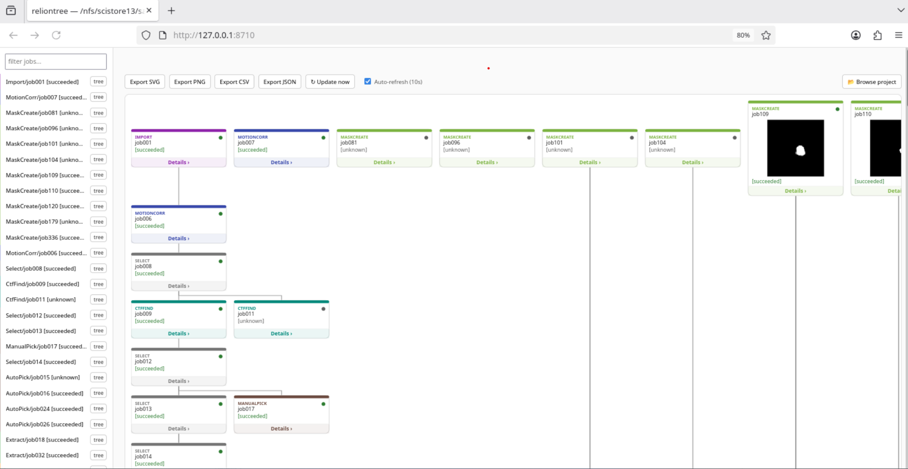

# reliontree

Standalone RELION job-lineage viewer. No ChimeraX, no third-party server
framework, no GUI toolkit — the default path is a self-starting stdlib-only
local server. Same single command on a workstation, an HPC login node (no
X11, no root), or a cloud VM.

## Install and run

```bash
uvx reliontree
```

No `uv`? `pipx run reliontree` works the same way — both run reliontree in
an isolated environment with nothing left behind. For a persistent
installation in an existing environment:

```bash
pip install reliontree
```

## Zero-config

```bash
reliontree
reliontree /path/to/project    # same, pointed at an explicit directory
```

Run from inside (or under) a RELION project directory. With no arguments,
reliontree walks upward looking for `default_pipeline.star` — the same way
`git status` finds its repository — and opens a live local view in your
browser: job cards with map/mask thumbnails, a click-to-browse sidebar, and
an in-page directory picker to switch projects. If no project is found at
all, it still starts and lets you browse to one instead of exiting with an
error.




On a machine with no browser available (a cluster login node), use
`reliontree tree --format html -o tree.html` for the old single-file static
export instead — no server, just a file to `scp` back or open from a
mounted path.

## Commands

### `tree` — job lineage

```bash
reliontree tree .                              # ASCII tree in the terminal
reliontree tree . --format json                # machine-readable, for scripts/agents
reliontree tree . --format html -o tree.html   # explicit static HTML file
reliontree tree . --format svg -o tree.svg     # raw SVG only
reliontree tree . --job Class3D/job012         # just that job's upstream lineage
reliontree tree . --job Class3D/job012 --max-hops 3
```

`--format json` is the integration point for scripts or AI agents: a
structured graph (`jobs`, `parents`, `artifacts`, `stats`) instead of text to
parse, with defined exit codes (see below).

### `table` — job history as CSV/Markdown

```bash
reliontree table . --format csv -o jobs.csv
reliontree table . --format md
```

One row per job: type, state, parent(s), resolution, particle count — for a
supplementary table or a quick spreadsheet import.

### `methods` — draft methods-section paragraph

```bash
reliontree methods .
```

One line per job, assembled from each job's own recorded parameters
(`job.star`) and outcome (resolution/particle count) — a starting point to
edit, not a citation-ready paragraph.

### `watch` — live-refreshing local view, with options

```bash
reliontree watch .
```

This is what bare `reliontree` runs under the hood with its defaults; the
`watch` subcommand exposes the knobs: `--port` (default `8710`),
`--interval` (auto-refresh seconds, default `10`), `--no-open` (skip
auto-opening the browser), plus the same `--job`/`--max-hops` as `tree`. A
local server (Python's stdlib `http.server`, no Flask/Streamlit) rebuilds
the tree on every request; usable on HPC/cloud too via an SSH tunnel.

## Exit codes

For use in scripts or CI:

| Code | Meaning |
|---|---|
| `0` | ok |
| `1` | no RELION project found (no `default_pipeline.star` in the given/current directory or any parent) |
| `2` | parse or job-lookup error (e.g. `--job` names a job not in the pipeline) |

## Using reliontree as a library

Everything the CLI does is also a plain importable function — useful for a
notebook, a script, or another tool's pipeline:

```python
import reliontree

project = reliontree.find_project(".")        # or a specific path
tree = reliontree.build_tree(project)
html = reliontree.render_html(tree, title=str(project))

rows = reliontree.history_rows(
    reliontree.ordered_jobs(tree), tree["artifacts"], tree["parents"], tree["stats"],
)
csv_text = reliontree.rows_to_csv(rows)
```

`tree` is a plain dict (`layers`, `parents`, `artifacts`, `stats`, `options`,
`job_dirs`) — no custom classes to learn.

## How reliontree fits alongside other RELION tools

[Follow_Relion_gracefully](https://github.com/dzyla/Follow_Relion_gracefully)
and [CNIO_Relion_Tools](https://github.com/cryoEM-CNIO/CNIO_Relion_Tools)
are Streamlit/Dash apps — a good fit when running a small web server and
reaching it from a browser is easy.
[himena-relion](https://github.com/hanjinliu/himena-relion) is a desktop
GUI, which makes sense when you want a full interactive workstation tool
with a display attached. reliontree targets a narrower situation those
aren't aimed at: an SSH-only cluster login node with no display and often
no spare port to open. Its default view is still live in a browser, just
via Python's own stdlib `http.server` bound to `127.0.0.1` — nothing to
install, no port beyond your own machine. When even that's not reachable,
`reliontree tree --format html -o tree.html` falls back to a single static
file instead.

Want to run `reliontree watch` as its own SLURM job instead of inside a GPU
allocation (it never needs a GPU, and shouldn't tie one up)? `contrib/slurm/`
in the repo has a minimal, CPU-only `sbatch` template and the SSH-tunnel
steps to reach it from your laptop.

Cluster provides software via `module load` instead of `pip install`?
`contrib/modules/` has an Lmod/Tcl modulefile — once an admin sets it up,
`module load reliontree` puts the exact same `reliontree` command (all the
same subcommands and options) on `PATH`.

## Origin

The pipeline-parsing and job-tree-diagram logic here started as the
Qt/ChimeraX-free core of the
[ChimeraX-InstantMap](https://github.com/LUKASinScience/ChimeraX-InstantMap)
plugin's RELION History tab — extracted into its own package since it never
needed ChimeraX to begin with. ChimeraX-InstantMap's homepage:
[github.com/LUKASinScience/ChimeraX-InstantMap](https://github.com/LUKASinScience/ChimeraX-InstantMap).

## Contributors

- Lukas W. Bauer ([LUKASinScience](https://github.com/LUKASinScience)) — author
- Claude Code (Anthropic) — AI pair-programming assistant, wrote and
  reviewed a substantial part of this codebase alongside Lukas
- Serhat Dönmez ([serhatdonmez98-cmd](https://github.com/serhatdonmez98-cmd)) —
  concept, screenshots and demo GIF for the README/docs

## License

GNU Affero General Public License v3.0 (AGPL-3.0-or-later).
